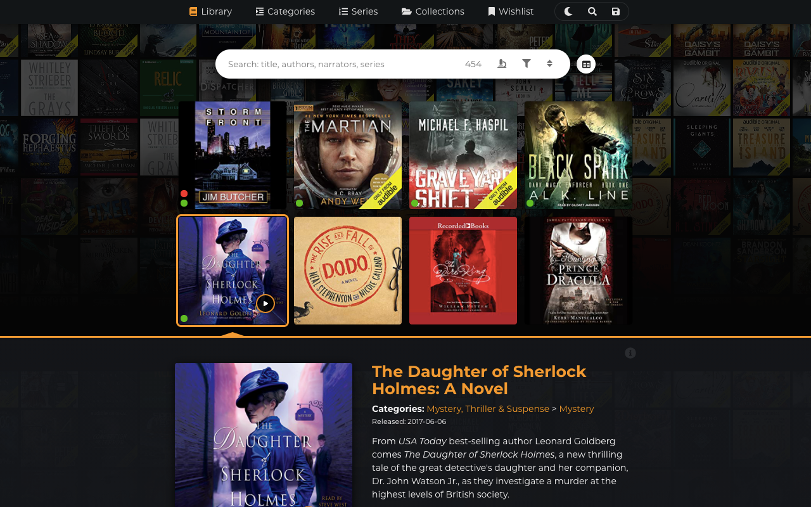

# Audible Library Extractor

Automatically generates a searchable gallery from your Audible library. Additionally, you can extract collections and wishlist **** too. If you upload the gallery online, you can share it with others ([like this](https://joonaspaakko.github.io/my-audible-library/#/library)) or you can use the gallery to find your next listen on mobile and [easily open the book in Audible's mobile app](gallery/next-listen-mobile-use.md#open-book-in-audibles-mobile-app).


[installation](installation/)








Note: to get to this point, you need to [upload the gallery](sharing/uploading-to-github/) (website) online, go to the website on mobile and save it to the home screen on your phone.





## Features

* **Extract**
  * Library
  * Collections
  * Wishlist
* **Gallery**
  * Can be saved as a [stand-alone gallery](sharing/saving-gallery-locally.md) that can be [uploaded online](sharing/uploading-to-github/). Once online you can share it with others or use it alongside Audible's mobile app to find your next listen, since it works great on mobile. All the gallery links below lead to my library hosted in Github for free.
  * **Pages**
    * [Library](https://joonaspaakko.github.io/my-audible-library/#/library)
    * Subpages (generated from library data)
      * All of these can show books from the library or the wishlist depending on the availability _(Since v.0.2.6)_
      * [Categories](https://joonaspaakko.github.io/my-audible-library/#/categories/)&#x20;
      * [Series](https://joonaspaakko.github.io/my-audible-library/#/series/)
      * [Authors](https://joonaspaakko.github.io/my-audible-library/#/authors/)
      * [Narrators](https://joonaspaakko.github.io/my-audible-library/#/narrators/)
      * [Publishers](https://joonaspaakko.github.io/my-audible-library/#/publishers/)
    * [Collections](https://joonaspaakko.github.io/my-audible-library/#/collections/)
    * [Wishlist](https://joonaspaakko.github.io/my-audible-library/#/wishlist/)
    * **View modes**
      * [Grid](https://joonaspaakko.github.io/my-audible-library/#/library?view=grid)
      * [Spreadsheet](https://joonaspaakko.github.io/my-audible-library/#/library?view=spreadsheet) (readonly)
* ****[**CSV export**](gallery/csv-export/)****
  * CSV files can be opened in any spreadsheet application, like say Excel.
  * Compatibility options
    * **Google Sheets:**
      * Has some special GS specific formulas)
    * **Raw data:**
      * Basically as vanilla as CSV data gets and can be imported to any application, whereas the csv with Google Sheets compatibility wouldn't work so well in other applications.
    * **Goodreads:**
      * Only the essential information for Goodreads import

## In Github

This is an open source project so all the source files can be found in Github.

* [Github project page](https://github.com/joonaspaakko/audible-library-extractor)
* [Github issues page](https://github.com/joonaspaakko/audible-library-extractor)


If you encounter **bugs** or have **feature requests** or even just **questions**, please make a post in [Github issues](https://github.com/joonaspaakko/audible-library-extractor/issues?q=is%3Aissue+is%3Aopen+sort%3Acreated-desc).


## Region support?

I would love for this to work on all of the different regions but as of now I would only expect it to work in `audible.com` and possibly any other English Audible websites.&#x20;

On other audible sites you may have issues where the extraction stops because it's trying to parse the data using English words (on occasion). Even if the extraction goes through, the gallery may suffer from similar issues and show up blank or otherwise broken.

If you're having trouble using the extension in another region/language, please post an [issue](https://github.com/joonaspaakko/audible-library-extractor/issues) in Github (in English, please).&#x20;

> The generated gallery page is in English and I have no current plans to translate that to other languages.

