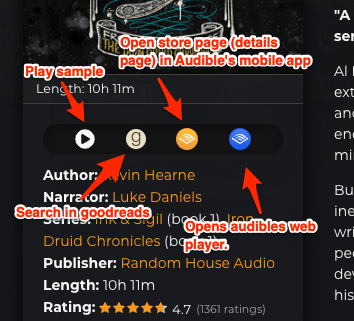

# Icon bar in book details

You can open book details by clicking the cover in grid view or the row in spreadsheet view. In there on the left sidebar you got 4 icon buttons that can be extremely useful:

**Starting from the left:**

1. **Play sample**
2. **Goodreads search**
3. **Open in mobile app**&#x20;
   * On a desktop browser this opens the book's store page.
   * You can also find this button in the  `My books in the series` list that sits under the rating.
   * This button also works with books from your wishlist or for any random visitor as it simply opens the store page/details page in the app.&#x20;
   * If the store page doesn't open it could be because the specific version of the book no longer has a store page.
4. **Web player**&#x20;
   * Only plays the book if you are logged in (or login) to Audible and you own the book. So there's no need to worry someone will be listening to your books if you share a link to the gallery.&#x20;
   * The extension has no control over this player and its possible quirks. Like for example, there was nothing I could do when it just wouldn't play anything on IOS for a long time not so long ago. This icon button is simply a direct link to the web player offered and maintained by Audible.

