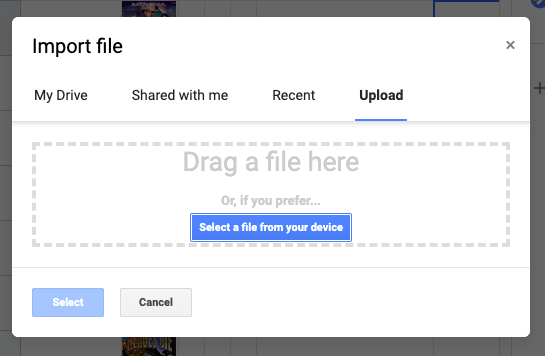
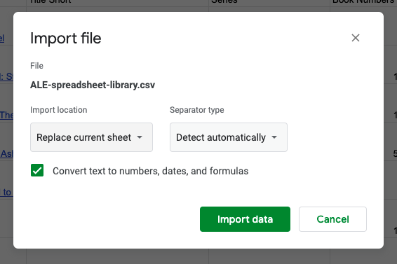

# Google Sheets import

I chose to write instructions for Google Sheets as it's the most accessible option and it even has public link sharing. The image formulas are a nice addition too, I think. Here's an example of [what my library looks like in Google Sheets](https://docs.google.com/spreadsheets/d/1clOlIEPB\_7Ukrq4Don-ANQg201iwRGy8EYFPvQM7DJA/edit?usp=sharing) (after some edits that I've outlined [below](google-sheets-import.md#google-sheets-edits)).&#x20;


Google Sheets import isn't more difficult than with any other application, so if you are confident you know how to import files to Google Sheets, you can skip these instructions but just make sure to check the checkbox that says "**Convert text to numbers, dates and formulas**", so the Google Sheets compatible formulas will execute.&#x20;


### Import

1.  From the top menu `File > Import:`Choose the `Upload` tab from the Import file dialog

    
2. After uploading a file you get the Import file dialog**:**&#x20;
   * **Import location**: `Create new spreadsheet` or `Replace current sheet`
     * If you update a spreadsheet you've already imported once, using `Replace current sheet` will place the new data on top of the old data and it retains a lot of the general formatting, but unfortunately not all of it.
   * **Separator type**: `Detect automatically`
   * **Check the checkbox**: `Convert text to numbers, dates and formulas`, so the links and images show up properly.
   * 

### Recommended edits

These are just some edits that I would consider essential, but I am pretty particular about my spreadsheets. You can leave it be after the export if you feel like it's fine as it is, but this list below should help if you want cleaner formatting.&#x20;

> This is what [my library](https://docs.google.com/spreadsheets/d/1clOlIEPB\_7Ukrq4Don-ANQg201iwRGy8EYFPvQM7DJA/edit?usp=sharing) looks like after these edits. This is the same link as above. If you saw that, there's nothing new behind this link.

1. **Make sure cell contents don't overflow:**&#x20;
   * Click the top left corner of the header to select every single cell&#x20;
   * From the top menu `Format > Text wrapping > Clip`
2. **Make all rows taller to fit the cover images a bit better**
   * Cover images fit inside the cell so you can make them as large as you want,  but the icons are all 20x20px
   * Click the top left corner of the header to select every single cell
   * Drag one of the row borders from the gutter (line numbers)  to adjust the height
     * I would recommend you make the new heights about 2 default row heights
3. **Align all cells to the middle (vertically)**
   * Click the top left corner of the header to select every single cell&#x20;
   * From the top menu `Format > Align > Middle`
4. **Squish all image columns so they take as much room as is needed**
   * Select all image column headers by clicking them with the `Cmd` modifier key (Mac) or `Ctrl` modifier key (Windows)
   * Drag one of the columns from right to left.
   * I would make the cover column slightly wider than the rest of the icons.
5. **Center all image columns (horizontally): `Format > Align > Center`**
6. **Freeze header and all columns up to the title**
   * Click the `title` (header) cell
   * From the top menu `View > Freeze` `>` `Up to current row (1)`
   * From the top menu `View > Freeze` `>` `Up to current column (F)`
7. **From the top menu: `Format > Alternating colors`**
8. **I also hid some columns: `Right-click on the column header`** **`>`** **`Hide column` and adjusted several column widths.**
   * I opted to hide some unnecessary columns rather than move any, because next time I update the list by import, I don't want to have to fiddle with the order. There is no way to control the column order on export from the gallery.
