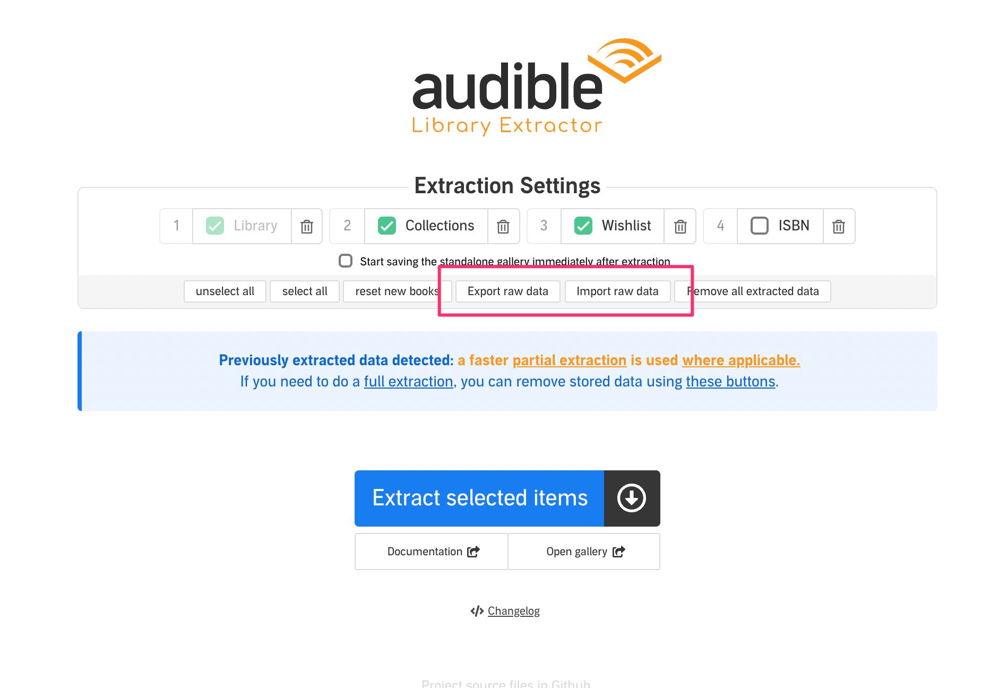

# Import / export data

Starting from v.0.2.7 you can import and export extracted data as is, meaning that you  can recover extracted data on a new computer or a new install without having to do a full extraction. You can also transfer data from FF to Chrome or the other way around.

