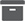
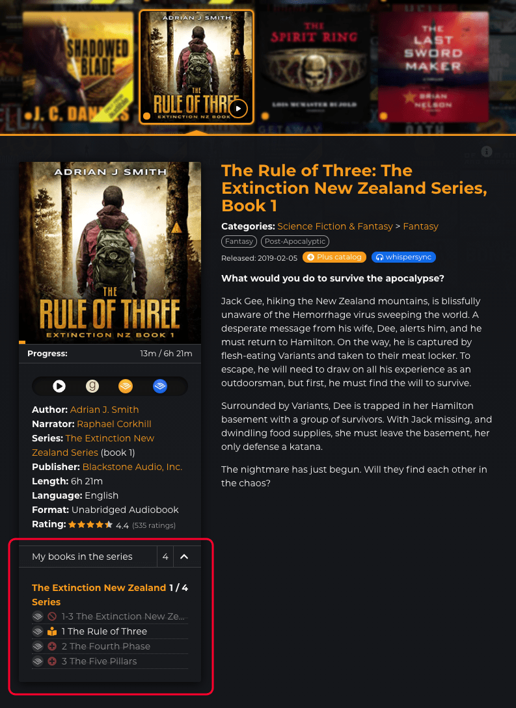

# My books in the series list

It's really useful for finding the next book in the series because the statuses are clearly indicated with icons and some other visual cues. Finished books and books you don't own are dimmer so it's easier to find the next book in the series.

*  **Open in Audible's mobile app** _(if possible)_
*  **Not started** - Clicking these books takes you to the **series sub page**.
*  **Started** - Clicking these books takes you to the **series sub page**.
*  **Finished** - Clicking these books takes you to the **series sub page**.
*  **Not in your library** - Clicking these books takes you to the **store page** in Audible.
*  **In plus catalog -** Clicking these books takes you to the **store page** in Audible. (since v.0.2.7)

> You can also hover over the icons on a desktop browser to see what they mean, in case you forget.

