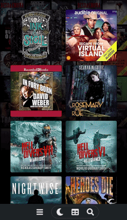
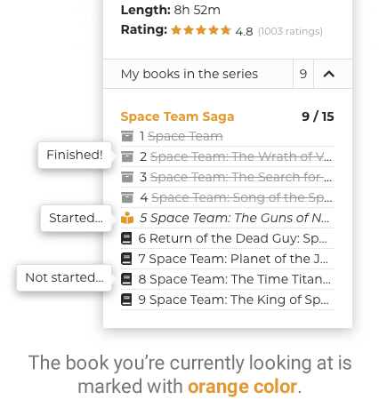
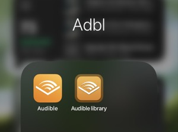

# Find next listen & mobile use

After the gallery has been uploaded online, you can show others what you have in your Audible library by sharing a link to it, but it can also serve the purpose of helping you find your next listen on mobile. Obviously theg is available for you to use on a desktop computer immediately.&#x20;

Below I've listed some key features that may not be immediately obvious, but make it really easy to use the gallery in conjunction with the mobile app.


You have to upload the gallery online to use it on mobile. Check upload instructions [here](../sharing/uploading-to-github/).&#x20;


### Open book in Audible's mobile app

There's a handy dandy iconin book details that opens the book to the details page (or store page) in Audible's mobile app so you can easily start listening to the book.


On a desktop browser or when a mobile app is not available, this link will open the book's store page on the website.


### My books in the series list

This is probably my most used feature. It's great for figuring out which book is next in the series. It lists all the books you have in the series in the same order they appear on Audible's series page but it also shows the status of each book, which is something you can't see in Audible's series page. More details [here](my-books-in-the-series-list.md).

Clicking a book title/row takes you to the [series subpage](https://joonaspaakko.github.io/my-audible-library/#/series/B077XNSN35) with the book details already open.

### Home screen icon

You can save the website as an icon to your mobile device's home screen just like any website ([instructions](https://www.howtogeek.com/196087/how-to-add-websites-to-the-home-screen-on-any-smartphone-or-tablet/)).

Adding the home screen icon isn't necessary, but it does make it easier to access, especially if you open it like daily. Also, it won't oopen the gallery in your browser as a tab but rather as it's own app window.&#x20;

> You have to do this only onc. When you update the gallery online, all you have to do is (maybe) close the "app" and then open in from the icon.

> On **IOS** there's a confirmation that pops up when you click the open in app icon, but it's skipped when you run the website from the home screen icon. You do have to click "done" if you go back to the gallery afterwards.


Since the home screen icon is basically a glorified bookmark that saves the current address as is, you can change filtering and sorting before saving the icon and it will remember those settings when it's opened. For example, you can make the icon open your library while excluding `started` and `finished` books.



There used to be a bug on iOS in this standalone mode, when it's saved to the home screen, where it would stop playing audio on lock ascreen or really whenever the "app" wasn't in focus. This has been fixed on iOS 15.4.1.

So now, as long as your iOS is up to date, you can listen to the samples or books using the cloud player (blue audible icon in the gif) in every version of the gallery without having to keep the app open.


