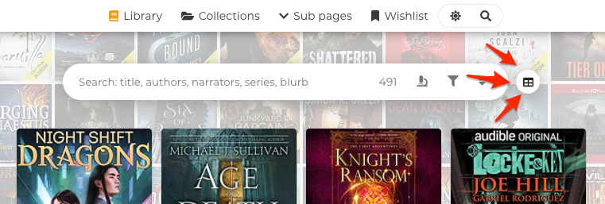
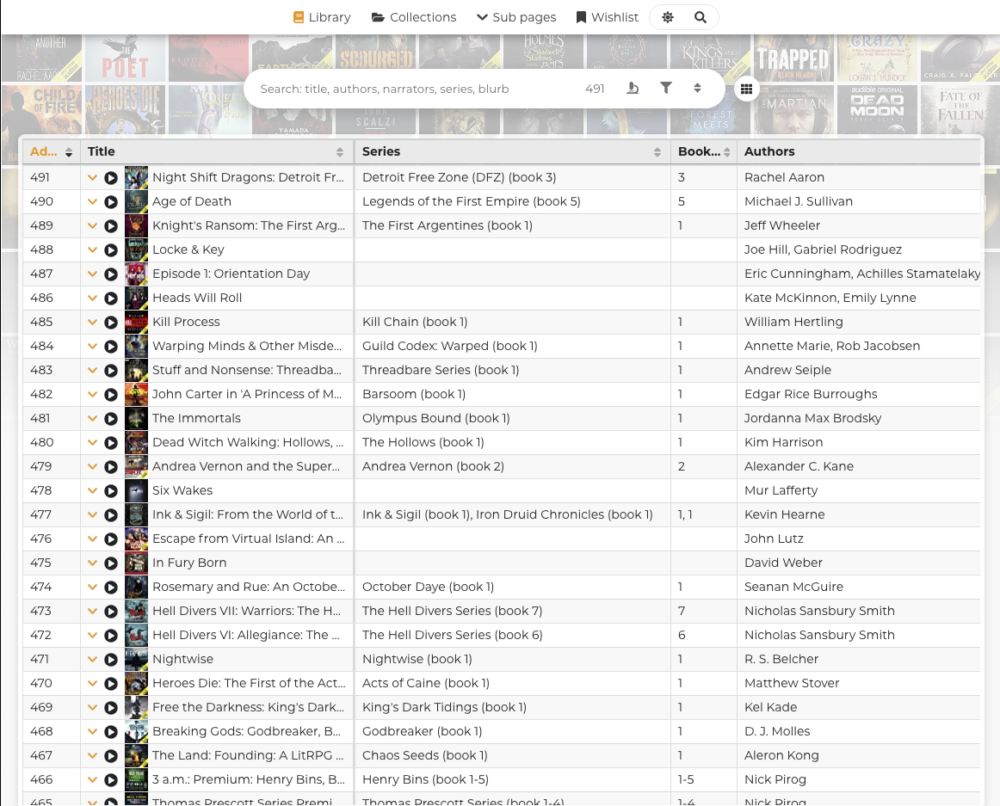

# Spreadsheet view

By default when you open the gallery you see the grid view, but there is also a spreadsheet view that is readonly. It's not meant to compete with any actual spreadsheet application, it's really just a list view for anyone who prefers to view data in this format. It has all the same features the grid view has: searching, filtering, sorting, and clicking the row opens book details.

* You can toggle between the two view modes using the icon button next to the search field. _This icon moves to the bottom menu in certain mobile sizes._
* You can also use the [CSV export](csv-export/) to export the gallery data and import to whatever spreadsheet application you like.

### Spreadsheet view info

* Clicking a row opens book details
* You can move to another row with arrow keys after opening book details by clicking any row and the same thing works in the grid view. Arrow keys work similarly in the grid view.

