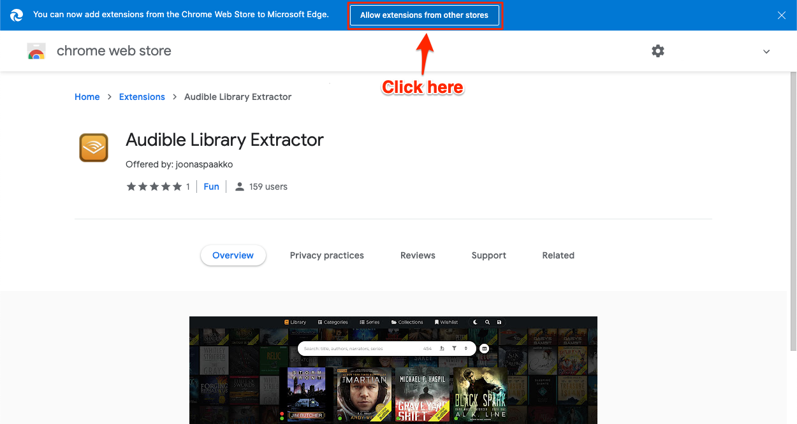

# Edge installation instructions


This will not work in the legacy Edge browser that came with Windows 10 since 2015. The Chromium version of Edge was released January 15, 2020 and can be downloaded [here](https://www.microsoft.com/edge).&#x20;

> Also importantly, support for Edge (legacy) has ended as of March 9, 2021 meaning it won't be getting any more security updates. If you have kept your Windows 10 up to date, it should've automatically replaced the legacy browser with the new Chromium based version. You can read about this switch straight from the source [here](https://techcommunity.microsoft.com/t5/microsoft-365-blog/new-microsoft-edge-to-replace-microsoft-edge-legacy-with-april-s/ba-p/2114224).


### 1. Go to the Chrome web store

Get the Chrome version of the extension here: [Audible Library Extractor in Chrome web store](https://chrome.google.com/webstore/detail/audible-library-extractor/deifcolkciolkllaikijldnjeloeaall).

### 2. Allow extensions from other stores

You should see this prompt if this is your first time installing an extension from other stores. Click the **"Allow extensions from other stores"** button if necessary.


If you don't see this **"Allow extensions from other stores"** prompt and you have istalled Chrome extensions before, you might be able to skip to step 4 and just click ”add to chrome”.

If that isn’t an option, you can navigate to the address `edge://extensions` or alternatively, click the browser's horizontal 3 dot menu in the top right corner choose `Extensions` and on that extension page at the bottom left corner, you can **enable** or **disable** the setting that will allow you to install extensions from other stores.


### 3. Confirm

### 4. Install

