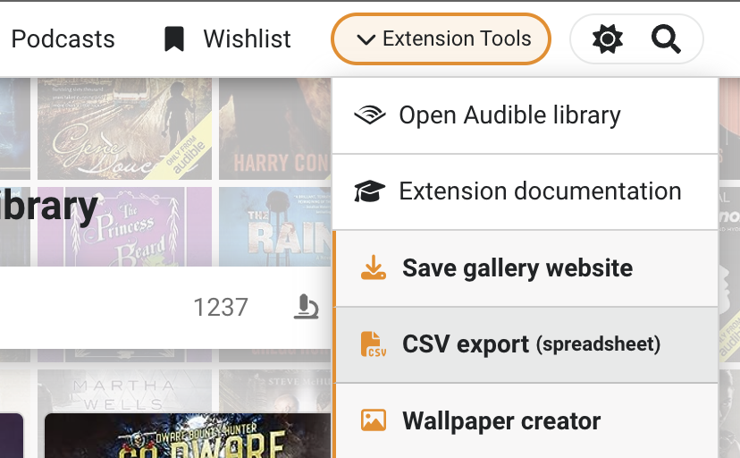

# Uploading to Github

Uploading a standalone gallery online will allow you to use it on a [mobile device](../../gallery/next-listen-mobile-use.md) or share a link with a friend so they can see what you have in your library.&#x20;

The GitHub upload process is a fairly lengthy process but it should be doable by just about anyone and it's a free way to get your library on the internet. **You don't need to touch any code**, it's just a matter of learning how it works and clicking your way through the process. You do have to know how to unpack a `.zip` file, move & delete files, and install one application.


If you have already done this once, you likely want to follow the [update instructions](updating-gallery-in-github.md) instead.


## Upload instructions

> If you are very familiar with GitHub and know how to publish a public repository just make the repository public and make sure you know exactly what files to put in the project folder as shown in [step 4](./#step-4-add-gallery-files-to-the-project-folder) (screenshot n.2). After publishing the repository enable GitHub pages as shown in [step 7](./#step-7-enabling-github-pages).

### Step 1 - Make an account

Register a (free) [github account](https://github.com/join).

> Note: your username will be part of the address where the gallery can be accessed from, like in my case my username is ”joonaspaakko”, so the url I ended up with was: `joonaspaakko.github.io/my-audible-library`

### Step 2 - Download Github Desktop

For things to not get totally out of hand in terms of complexity, you will definitely want to use the [Github Desktop client](https://desktop.github.com/), which is a graphical interface to create and manage projects in GitHub. It makes things very simple.&#x20;

Just as a heads up, you will do these things in and or around the Github Desktop client:&#x20;

1. Create a local project folder
2. Add in the unpacked standalone gallery files
3. Save that state (with a commit)&#x20;
4. Upload (push) the files to your Github account


Don't try to upload files through the GitHub website, you'll regret it.


### Step 3 - Make a new local project (screenshot below)

The only thing you need to add when creating a new project (`repository`) is the name.

You add a new local project from the top menu:&#x20;

1. `File > New repository`&#x20;
2. I named mine `my-audible-library`.

More info on naming

This kebab-cased repository name is going to form a part of the website address. It will be something like: `YOUR-USERNAME.github.io/YOUR-REPOSITORY-NAME`. As I mentioned before, mine ended up being: `joonaspaakko.github.io/my-audible-library`.  \
\
You can pretty much name this anything (within the obvious limits) but I'd advise keeping it short and descriptive so you can easily remember the url. The only real limit is that your account can't have duplicate project names. I just think that ”my audible library” is quite descriptive.&#x20;

### Step 4 - Add gallery files to the project folder  (screenshot below)

After you've created a new project (`repository`), you should see a button on the right that opens the project folder. The button will likely say `Show in Finder` (Mac) or `Show in Explorer` (Windows).

**First, open the project folder:**

If you haven't already, save the standalone gallery to your hard drive **Extension tools > Save gallery website.**

<figure><figcaption>
After that it's pretty self explanatory...
</figcaption></figure>

Depending on how you unpack the zip file you'll likely end up with a folder called `ALE-gallery` right next to the zip file. I ended up moving the ALE-gallery.zip file into the repository folder (see the "my-audible-library" title at the top of this gif below)


Make sure to put all the files inside the "ALE-gallery" folder directly into your repository folder.



In hindsight, it may be simpler if you unpack the zip in the downloads folder and move or copy the files inside ”ALE-gallery” to the project folder.


> While usually not a crucial file, there’s one hidden file called ”.nojekyll” in the zip that can sometimes help when Github fails to ”build” the website. So you may look for that if there are build issues.&#x20;

### Step 5 - Save changes locally (screenshot below)

When you open Github Desktop again, it'll look a bit different because of the files you added. What you need to do is **add a summary** and **save changes** using the `Commit to main` button. If you want to keep the summary short, use the dash character `-`.


In regular projects **`Summary`** and **`Description`**are meant to inform everyone involved what was changed. In this case it doesn’t matter much, but you are required to add **`Summary`** every time you save (`commit`), hence the dash character.&#x20;


### Step 6 - Upload files to Github  (screenshot below)

Start the upload by clicking the `Publish repository` button. Then super importantly in the following window uncheck `Keep this code private` (more on that below the screenshot).

After clicking "publish", you can still finalize some settings, but **the only thing you need to do here is uncheck:** "Keep this code private".&#x20;

> This can be changed later in the project (`repository`) settings through the website, but things will go smoother if you just remember to make it public here.


The reason why this setting is a must is that the free GitHub account only allows you to host a website if the repository is public.&#x20;

> This means that the files will be slightly more freely available than on a more traditional hosting platform. For example, the repository for [my audible library website](https://joonaspaakko.github.io/my-audible-library/) is accessible from [this address](https://github.com/joonaspaakko/my-audible-library). Anyone can download this repository and use it as they please. it shouldn't be a problem in this case because this extension doesn't gather any personal information that could be used against you in any way.


### Step 7 - Enabling Github Pages  (screenshot below)

At this point, the project is online, but only as a public project repository (just the files essentially). You have to tell Github that you want it to be a website.

Go to the project (`repository`) online by clicking the `View on GitHub` button. **Open** the project **settings** and go to the **`Pages`** tab. You need to be logged in to access the settings.

Choose "**main**" branch in the **`Source` dropdown** and click **`Save`**.&#x20;


It may take a few minutes for the website to finish deploying. You can check the build status from the "Actions" page. [READ MORE HERE](double-check-if-site-is-online.md).

