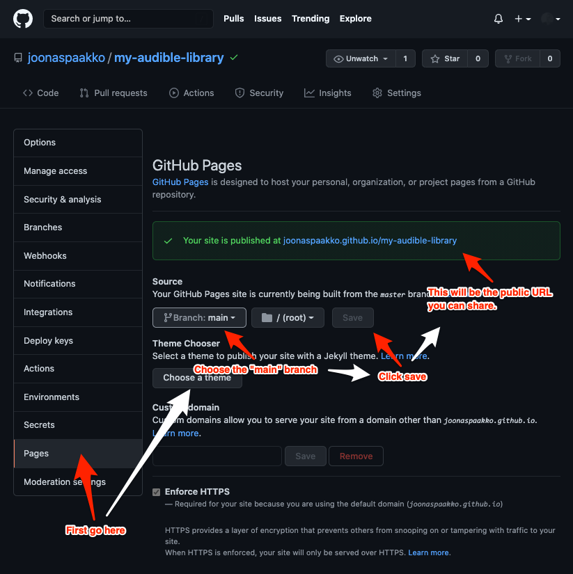

# Uploading to Github

Uploading to Github is a fairly involved process but it should be doable by just about anyone and it's a free way to get your site on the internets. **You don't need to touch any code**, it's just a matter of learning how it works and clicking your way through the process. You do have to know how to unpack a `.zip` file, move & delete files and install one application.


If you have already done this once, you likely want to follow the [update instructions](updating-gallery-in-github.md) instead.


## Upload instructions


If you are very familiar with Github and know how to publish a public repository just  make the repository public and make sure you know exactly what files to put in the project folder as shown in [step 4](./#step-4-add-gallery-files-to-the-project-folder) (screenshot n.2). After publishing the repository enable github pages as shown in [step 7](./#step-7-enabling-github-pages).



Each critical step has a screenshot.


### Step 1 - Make an account

Register a (free) [github account](https://github.com/join).

> Note: your username will be part of the address where the gallery can be accessed from, like in my case my username is ”joonaspaakko”, so the url I ended up with was: `joonaspaakko.github.io/my-audible-library`

### Step 2 - Download Github Desktop

For things to not get totally out of hand in terms of complexity, you will definitely want to use the [Github Desktop client](https://desktop.github.com/). The Github Desktop client is basically a graphical interface to create and manage projects in GitHub. It makes things very simple.

> In it you will define a project folder, add new files, and then upload the files to your Github account.

### Step 3 - Make a new local project

First make a new local project folder `File > New repository`. The only thing you need to add when creating a new project (`repository`) is the name. I named mine `my-audible-library`.

> This kebab-cased repository name is going to form a part of the website address. It will be something like: `YOUR-USERNAME.github.io/YOUR-REPOSITORY-NAME`. Mine ended up being: `joonaspaakko.github.io/my-audible-library`.  If you wanted to, you could make the project name just `audible`  or something. I'd advise to keep it short but descriptive so you can easily remember the url. The only real limit is that your account can't have duplicate project names. I just think that ”my audible library” is quite descriptive.

### Step 4 - Add gallery files to the project folder

After you've created a new project (`repository`) you should see a button on the right that opens the project folder. The button will likely say `Show in Finder` (Mac) or `Show in Explorer` (Windows).


If you’re wondering what files I’m talking about, go past this next screenshot.


If you haven't already, [save the gallery locally](../saving-gallery-locally.md) and unpack the`ALE-gallery.zip` file.&#x20;

Depending on how you unpack the zip file you'll likely end up with a folder called `ALE-gallery` right next to the zip file. You only need to put the files inside the `ALE-gallery` folder in your project folder and nothing else.


In hindsight it may be simpler if you unpack the zip in the downloads folder and move or copy the files inside ”ALE-gallery” to the project folder.



Here I’m unpacking the zip in the project folder and that process in my case creates an extra folder ”ALE-gallery”, like it should with most default methods of unpacking a zip, but this extra folder is not necessary and can cause issues since the the ”index.html” and the other files/folders should be directly in the project folder. Also in the gif the zip file is removed since it won’t be needed.


> While usually not a crucial file, there’s one hidden file called ”.nojekyll” in the zip that can sometimes help when Github fails to ”build” the website. So you may look for that if there are build issues. The way I’m dragging all visible files and removing the extra stuff in the gif makes it so the hidden file doesn’t end up in the project folder…

### Step 5 - Save changes locally

When you open Github Desktop again, it'll  look a bit different because of the files you added. What you need to do is **add a summary** and **save changes** using the `Commit to main` button. If you want to keep the summary short, use the dash character `-`.


In regular projects **`Summary`** and **`Description`**are meant to inform everyone involved what was changed. Since you are just making a website, it doesn’t matter much, but you are required to add **`Summary`** every time you save (`commit`), hence the dash character.&#x20;


### Step 6 - Upload files to Github

Start the upload by clicking the `Publish repository` button. Then in the following window uncheck `Keep this code private` (Check the two screenshow). You don't need to add or change anything else.

After clicking "publish", you can still finalize some settings, but **the only thing you need to do here is uncheck** `Keep this code private`. This can be changed later in the project (`repository`) settings through the website, but things will go smoother if you just remember to make it public here.


With the free Github account you can only host a website if the repository is public. This means that the files will be slightly more freely available than on a more traditional hosting platform. For example, the `repository` for [my audible library website](https://joonaspaakko.github.io/my-audible-library/) is accessible from [this address](https://github.com/joonaspaakko/my-audible-library). Anyone can download this `repository` and use it as they please. it shouldn't be a problem in this case because this extension doesn't gather any personal information that could be used against you in any way.


### Step 7 - Enabling Github Pages

At this point, the project is online, but only as a public project repository. You have to tell Github you want it to be a website.

Go to the project (`repository`) online by clicking the `View on GitHub` button. **Open** the project **settings** and go to the **`Pages`** tab. You need to be logged in to access the settings.

Choose "**main**" branch in the **`Source` dropdown** and click **`Save`**.&#x20;


It may take a few minutes for the website to finish deploying. You can check the build status from the "Actions" page. [READ MORE HERE](double-check-if-site-is-online.md).

