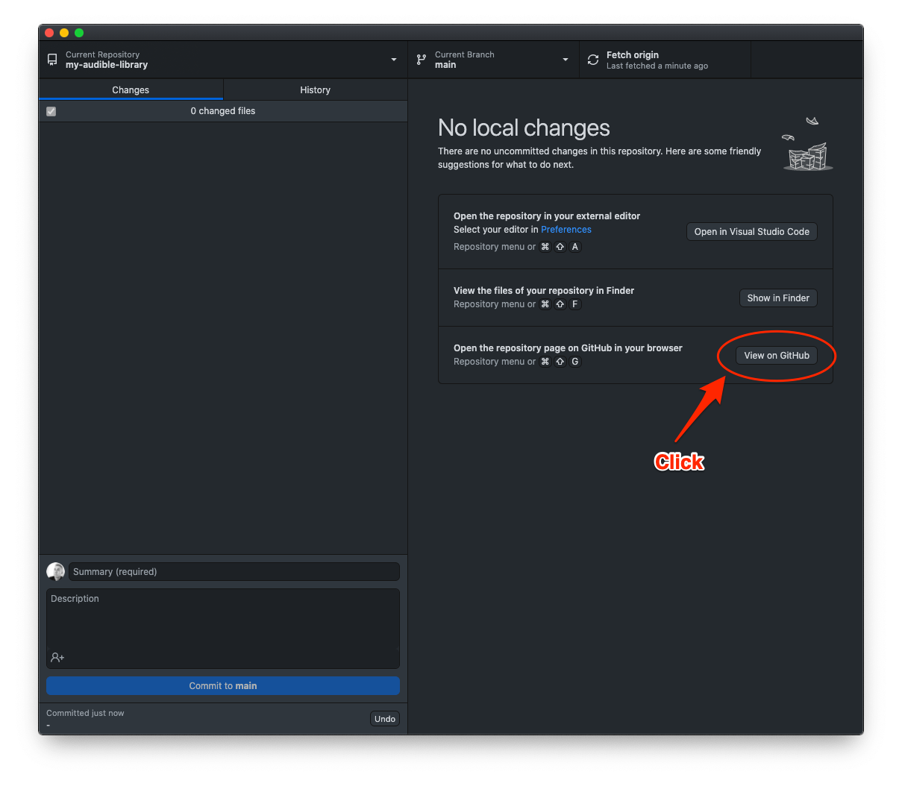
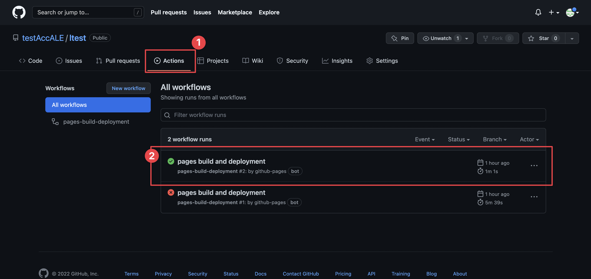
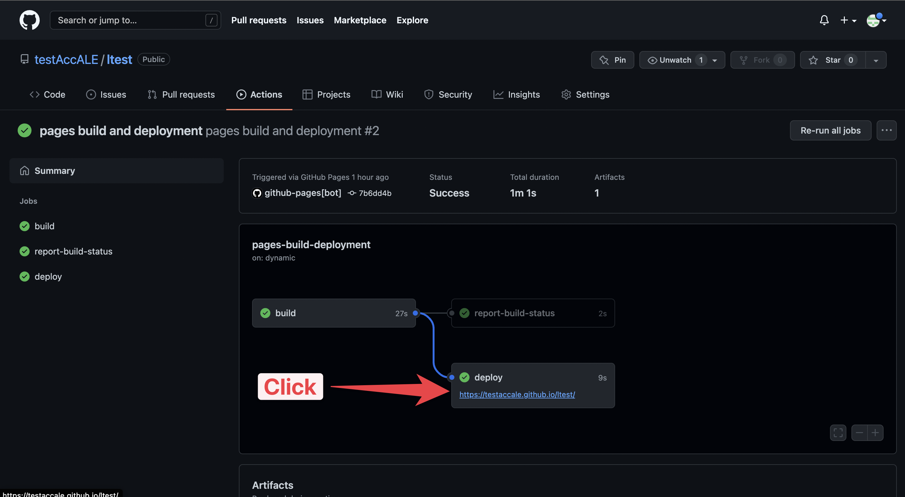
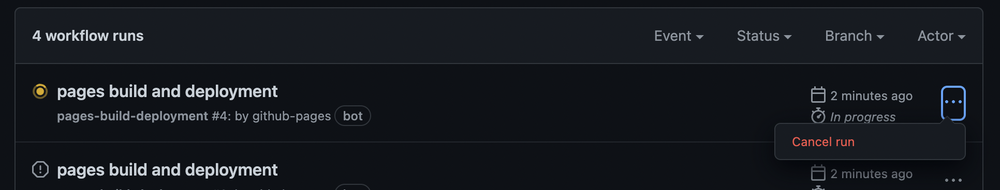

# Check if changes are online

After you upload or update the gallery to Github it may take a few minutes or even longer than that to show up online. To check the current status follow these steps.

### Step 1 - Going to the repository in Github.com

You can easily get to your repository page in [Github.com](https://github.com) from the Github Desktop client.

### Step 2 - Check build status&#x20;

Open the Actions page and see if the status looks ok.


If the top most deployment doesn't have a checkmark [check this video below](double-check-if-site-is-online.md#force-page-rebuild-video) to see how you can force Github to try to rebuild the page.


You can open the website by first opening the next page by clicking the title next to the checkmark :white\_check\_mark: `pages build and deployment`and then click the link:

### Force page to re-deploy (video)

The gist of it is that you disable "Github pages" and then enable it again, which will trigger a rebuild. See the video below...


If the deployment looks to be in `queue` or `progress` try canceling it first.



Video has no audio

