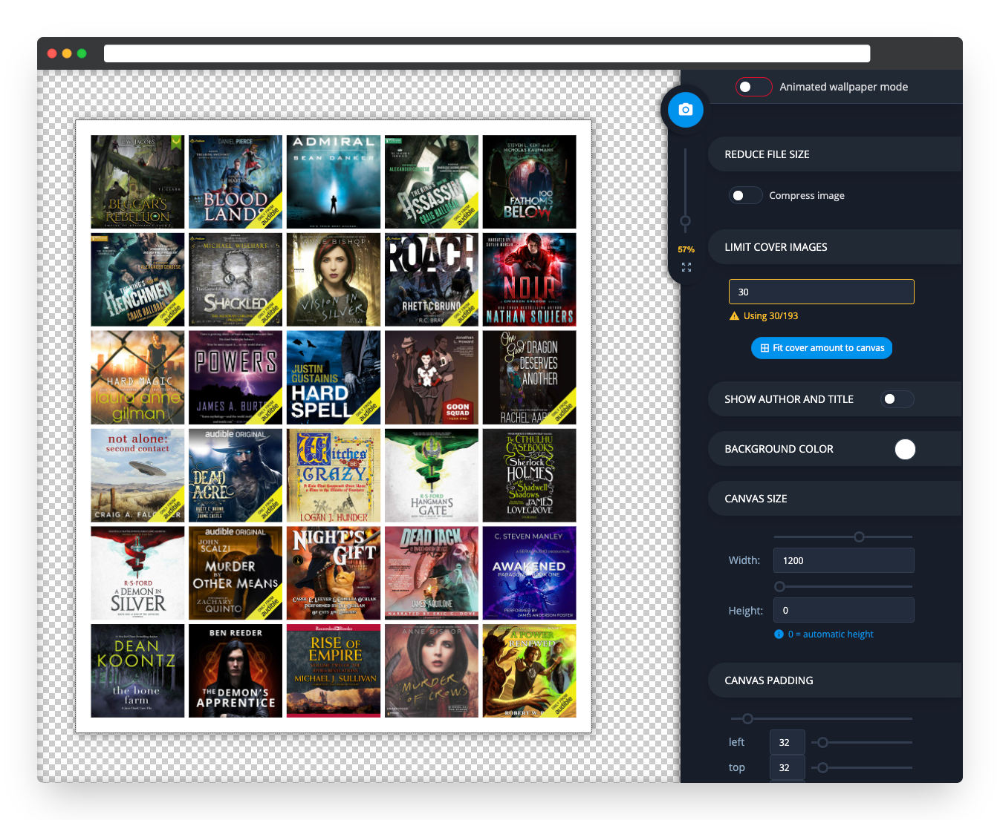
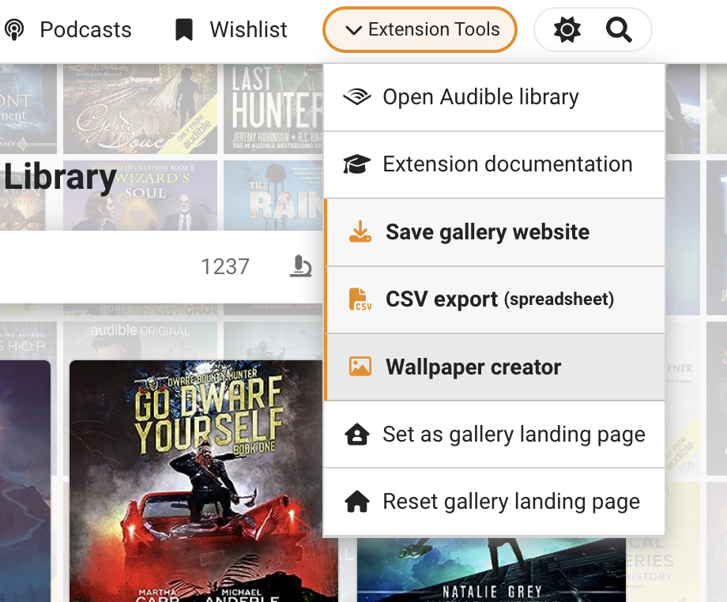

# Wallpaper creator info

The wallpaper creator can be used to create a gridded collage image using book covers from your extracted data: library, wishlist, collections, categories, etc...

 

### Opening the wallpaper creator

The editor can only be opened from pages that have books in them because it gets the cover images from the current page. If there are no covers on the page you are on, it won't open. The filters and sorting on the current page are honored by the editor when opened, though you can manually sort the covers by dragging them around.


As an example: if you want to save a collage from a specific Audible collection: navigate to the collection page and open the editor from the top right. The same goes for series or any other page with books.


<figure><figcaption></figcaption></figure>

### **Excluding covers**

The general gist of it is that the covers and their sorting are decided by the current page: what you see is what you get. This means that you can use the gallery pages and filters to kind of pick and choose what to include in broad terms. In addition to that, there are 2 options in the image editor that allow you to exclude books.

#### Wallpaper creator has these two options:

* **Exclude archived books**
* **Limit cover images**
  * You can manually sort covers in the editor by dragging them around with your mouse. So if you sort unwanted covers to the bottom and lower the cover limit, the unwanted covers will get dropped out.&#x20;
  * For the time being this is the only precise way to exclude any random cover you don’t want to have in the output image.

###  Saving the collage image

#### Saving

Use the blue circle-shaped button in the sidebar to save your image or the animated wallpaper.

#### Image size

Always preview the image after saving and make sure the canvas size/output size is big enough for your needs. If the covers are too small they tend to come out very grainy and blurry. If your target size is non-negotiable, you might be able to increase the cover size by decreasing the ”Covers per row” option. Conversely, increasing this setting can easily squish the covers into a small area.&#x20;

#### Compression

Images are compressed by default and therefore saved as **JPEG**. You can choose to disable compression on the sidebar on the right under the heading **"Reduce file size"**. You should only disable compression if you don't mind the potentially huge filesize, or you really need to save the image with a transparent or translucent background color. The uncompressed image is saved as **PNG**.

#### Adding text

Especially if you’re not using the image as a wallpaper you should know that there’s a section in the options called ”Add text” and a plus button to the right of it, which unsurprisingly adds text. Each text element is a single row of text but the editor doesn’t limit to how many text elements you can add.

You can edit the text in the canvas by double-clicking or rotate the text by dragging from the corners. You can also resize the text container from the corners to help you align the text more accurately. Speaking of alignment, each text element has icon buttons for aligning the text inside the container.

### Animated wallpaper or Screensaver

The editor has a mode for [animated wallpapers or screensavers](animated-wallpapers/), where cover images are randomly rotated in an infinite loop. When you open the wallpaper creator, you're immediately given the option to open the animated wallpaper mode.

### There's now a tier list mode

Starting from v.0.2.9 there is a Tier list mode in the style of TierMaker.com. Just like with animated wallpapers, when you open the wallpaper creator, you are immediately given the option to open the tier list mode.
