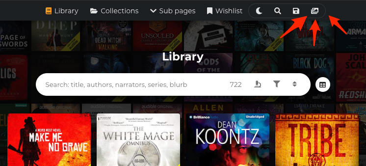

# Wallpaper creator info

The wallpaper creator _(since v.0.2.7)_ can be used to create a gridded collage image using book covers from your extracted data: library, wishlist, collections, categories, etc...

 

### Opening the wallpaper creator

The editor can only be opened from pages that have books in them, because it gets the cover images from the current page. If there are no covers on the page you are on, it won't open.&#x20;

The filters and sorting on the current page is honored by the editor when opened, though you can manually sort the covers by dragging them around.

&#x20;


As an example: if you want to save a collage from a specific Audible collection: navigate to the collection page and open the editor from the top right. Save goes for series or any other page with books.


### **Excluding covers**

The general gist of it is that the covers and their sorting is decided by the current page: what you see is what you get. This means that you can use the gallery filters to kind of pick and choose what  to include in broad terms. In addition to that, there are 2 options in the image editor that allows you to exclude books.

#### Options (look for the heading):

* Exclude archived books
  * Self explanatory
* Limit cover images
  * In the editor you can manually sort covers by dragging them around, so if you sort unwanted covers to the bottom and lower the cover limit, the unwanted covers will get dropped out. At the time of writing this documentation, this is the only precise way to exclude any random cover you don’t want to have in the output image.

###  Saving the collage

#### Saving

Use the blue circle shaped button in the sidebar to save your image or animated wallpaper.

#### Image size

Always preview the image after saving and make sure the canvas size / the output size is big enough for your needs. If the covers are too small they tend to come out very grainy and blurry. If your target size is non-negotiable, you might be able to increase the cover size by decreasing the ”Covers per row” option. Conversely, increasing this setting can easily squish the covers into a small area.&#x20;

#### Compression

By default images are compressed and therefore saved as **jpg**. You can choose to disable compression on the sidebar on the right under the heading **"Reduce file size"**. You should only disable compression if you don't mind the potentially huge filesize, or you really need to save the image with a transparent or translucent background color. Uncompressed image is saved as **png**.

#### Overlay (covers look dark or dim)

By default the editor starts with the canvas preset for desktop wallpapers and this includes an ”overlay” that dims the covers on purpose, so that if you have any icons on your desktop, you can actually see them.

This ”overlay” option can be disabled, but if you want that, there’s a good change that you should find the ”Canvas presets” option and pick ”Card” instead, since it’s geared more towards anything that isn’t a desktop wallpaper. That said the only thing that does is give you certain settings to star off with, which you can customize any way you want, with or without the preset.

> As a sidenote: the overlay, when enabled, has an added ”Overlay color” and ”Blending mode” options that you can use to add some unifying color, like a sepia tone or tint it slightly towards blue or whatever you want.&#x20;

### Adding text

Especially if you’re not using the image as a wallpaper you should know that there’s a section in the options called ”Add text” and a plus button to the right of it, which unsurprisingly adds text. Each text element is a single row of text but the editor doesn’t limit to how many text elements you can add.

In the canvas area you can edit the text by double clicking or rotate the rext a little by dragging from the corners. You can also resize the text container from the corners to help you align the text more accurately. Speaking of alignment, each text element has icons button for alignling the text inside the container.

### Animated wallpaper or Screensaver

The editor has a mode for animated wallpapers or screensavers, where cover images are randomly rotated in an infinite loop. Check the next page for more info on that.
