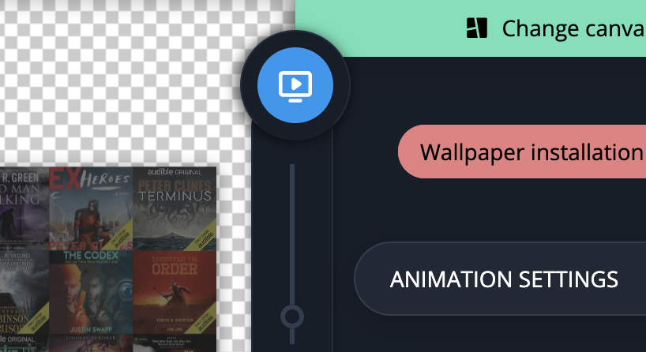

# Animated wallpapers

When you open the wallpaper creator, you're given the option to start making an animated wallpaper. On save it gives you basically a static website that keeps rotating the book covers indefinitely.&#x20;

This generated wallpaper can be used on **Windows** or **Mac** using 3rd party applications that can show websites as your desktop wallpaper. The saving process downloads all the covers, so they load fast locally and you don't need an internet connection to run it as an animated wallpaper or a screensaver.


Example of an animated wallpaper I uploaded online [**here**](https://joonaspaakko.github.io/ale-test-new/ale-animated-wallpaper-library/).


### Save animated wallpaper

Save the animated wallpaper using the big blue button:

<figure><figcaption></figcaption></figure>

Unpack the `.zip` file.&#x20;

> Preferrably not inside the downloads folder so it won't get lost or accidentally deleted

Then in the third-party app, add the folder or the index.html file inside it and activate the wallpaper if necessary.&#x20;

### **Windows apps**

1. [**Lively**](https://github.com/rocksdanister/lively) (free)&#x20;
   * [Instructions](lively.md) for Lively
2. [**Wallpaper Engine**](https://www.wallpaperengine.io) (\~$4)&#x20;
   * [Instructions](wallpaper-engine.md) for Wallpaper Engine
   * This can also make the wallpaper your screensaver.

### **Mac apps**

1. [**Plash**](https://sindresorhus.com/plash) (free) macOS 11 or later.&#x20;
   * [Instructions](plash.md) for Plash
   * There's also 10.5 compatible version in the [Plash's github repository](https://github.com/sindresorhus/Plash#download).
2. [**WebViewScreensaver**](https://github.com/liquidx/webviewscreensaver) (free)&#x20;
   * If it's not already obvious this application only allows you to set it as your screensaver.
   * Download the .zip file from github [releases](https://github.com/liquidx/webviewscreensaver/releases/latest).
   * No guide for this, but quickly, when you open the `WebViewScreenSaver.saver` , it gets added to your screensavers and you need to add a local path to the `index.html` file in the `url` input.

> There are probably similar apps for Linux, but I can't help with that.
