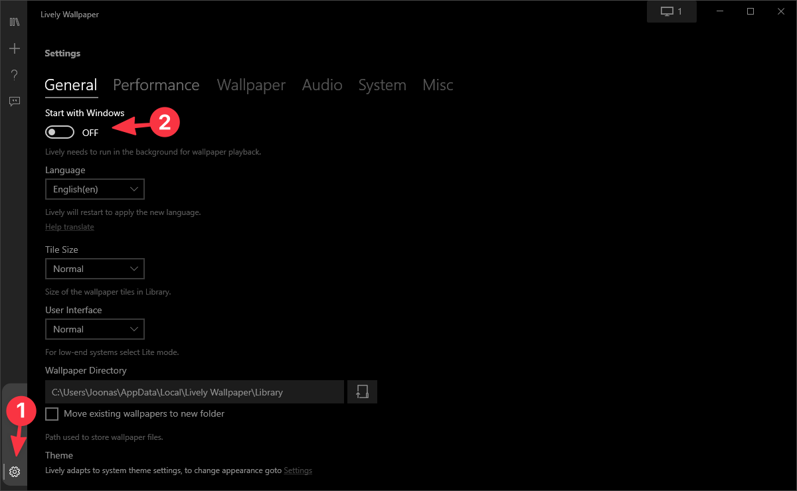
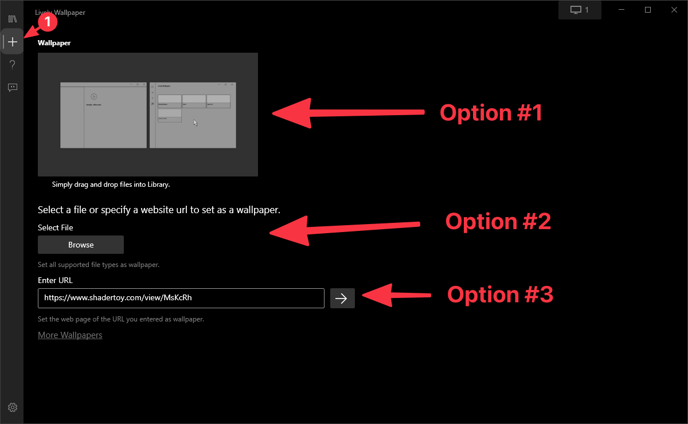
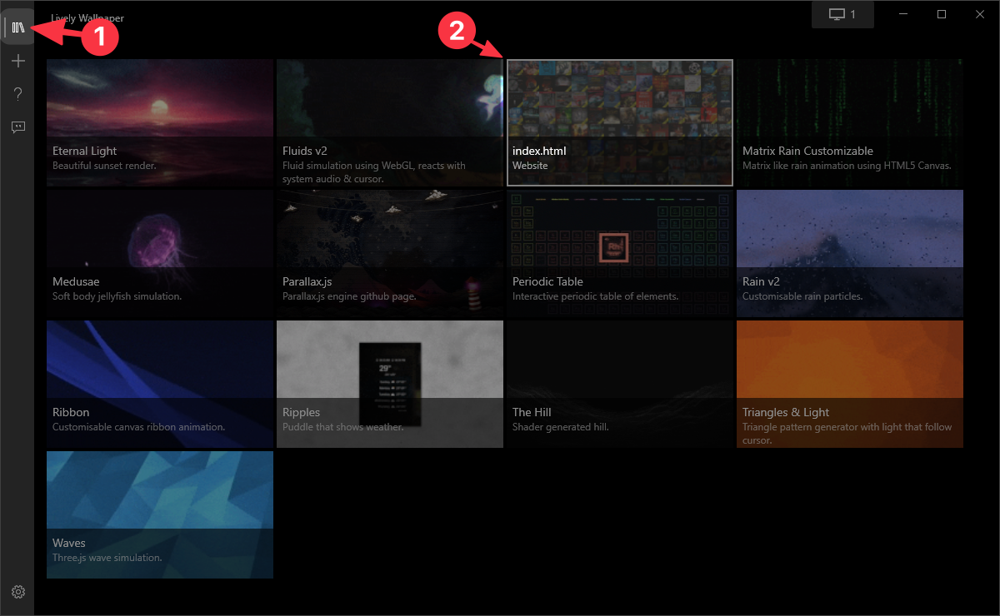

# Lively


At this point you should have saved the animated wallpaper and extracted the .zip file into a safe location, that is hopefully not the Downloads folder so you won't accidentally remove it.



**Download** [Lively here](https://github.com/rocksdanister/lively#download).


### Step 1: Start lively on startup

You'll likely want the wallpaper to always be on, so you should set it to open on startup.

### Step 2: Add your wallpaper

You should probably use option #1 or option #2 as marked below.

* **Option #1**: Just make sure you drag in the folder that contains the `index.html`
* **Option #2**: You can select the `index.html` or simply open the folder and click open

### Step 3: Activate the wallpaper

`right-click > Set as wallpaper`  to set as the current wallpaper.

