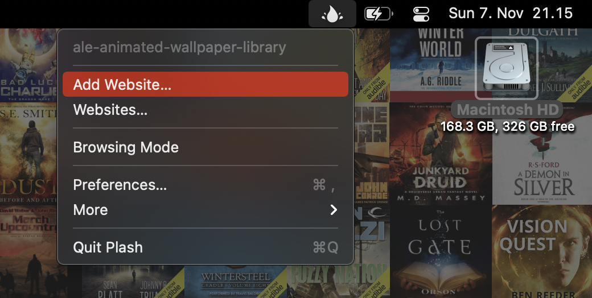
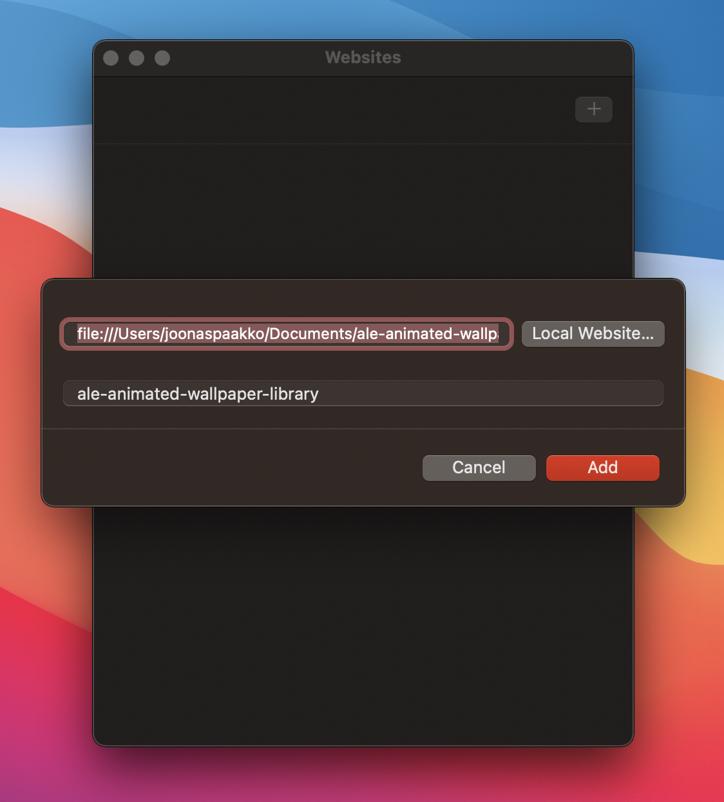
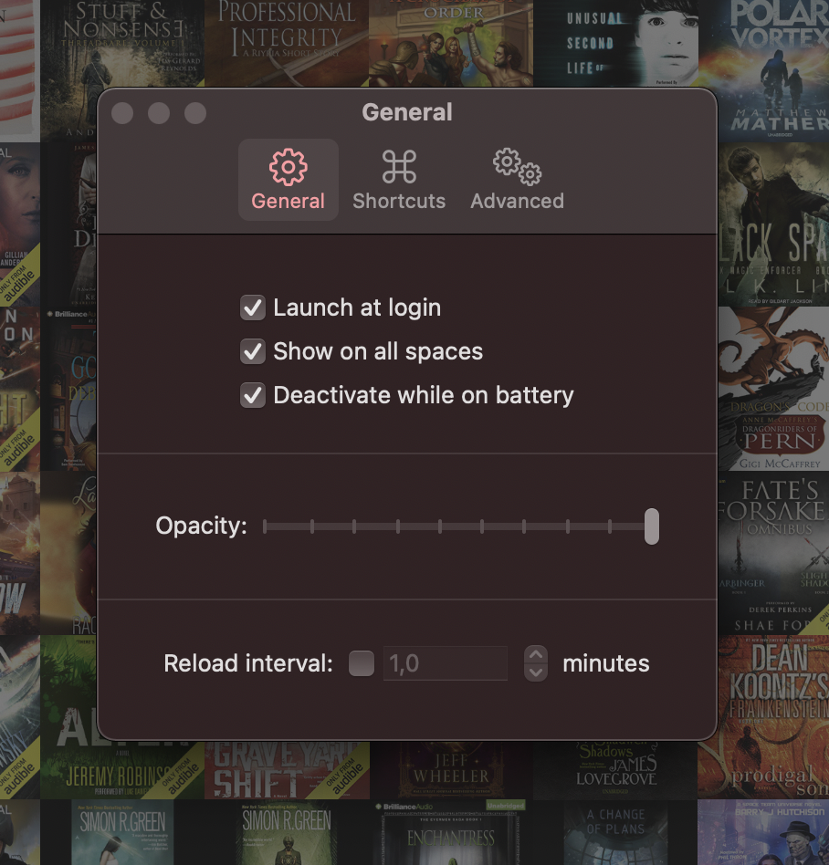

# Plash


At this point you should have saved the animated wallpaper and extracted the .zip file into a safe location, that is hopefully not the Downloads folder so you won't accidentally remove it.



**Download** [Plash](https://sindresorhus.com/plash).


### Step 1: Add animated wallpaper

Click the menu bar item and go `Add Website...`&#x20;

> The other option `Websites...` opens a window where you can edit, remove and also add wallpapers.

Add the wallpaper folder that contains the `index.html` file.

### Step 2: Confirm Plash starts on startup

In case it's not on by default, enable **Launch at login**.

